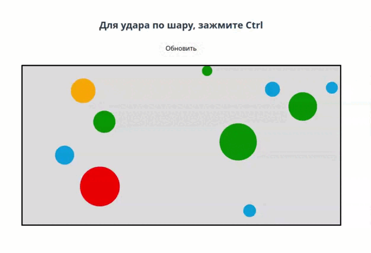

# Pool

Тестовое задание  
Алгоритм работы:

1. Приложи ссылку на url, по которому можно посмотреть на выполненное тестовое.
2. Я свяжусь с тобой и отвечу на вопросы
3. После этого - лайвкодинг с лидом
4. Если все ок, то делаем оффер.

Тестовое задание. Необходимо выполнить в отдельном проекте и залить на сервер демку, в котором его можно потрогать. В качестве ответа приложить URL демки и открытый репозиторий с кодом.  
Напишите демку "биллиард" на canvas, без использования сторонних библиотек отрисовки и физики.

Технологии: Canvas, TS, React

Суть игры:

- Есть прямоугольное поле Canvas, на прямоугольном поле расположены шары разного размера
- Я могу толкнуть мышкой шар в сторону
- Шар упруго соударяется с другими шарами и стенками, часть импульса при соударении теряется.
- Если шар кликнуть, то появляется менюшка, выполненная с помощью React, с помощью которой можно поменять цвет заливки шара.

### Результат

